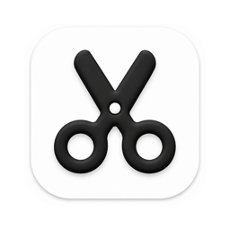

<p align="center">
  <a href="README.md">English</a> · <a href="README-CN.md">中文文档</a>
</p>

<p align="center">
  
</p>

<h1 align="center">MacClippy</h1>

<p align="center">
  <strong>专为 macOS 打造的高性能、极致轻量原生剪贴板管理器。</strong><br>
  100% 纯 Swift 与 AppKit 开发，集成 SQLite FTS5 全文搜索、Apple Vision 离线 OCR 与钥匙串硬件级加密。
</p>

<p align="center">
  <a href="https://github.com/wangm12/mac-clippy/releases/tag/nightly"></a>
  <a href="https://github.com/wangm12/mac-clippy/releases"></a>
  
  
  
  
</p>

---

## 产品简介

macOS 原生剪贴板只能保留单条记录，只要执行一次新的复制，之前的内容就会被永久覆盖。

**MacClippy** 是一款专为 Mac 深度定制的轻量级、隐私至上的原生剪贴板管理利器。不同于动辄占用数百兆内存、启动缓慢的 Electron 或 Web 包装类工具，MacClippy 采用 **100% 原生 Swift 与 AppKit** 打造。它具备按键毫秒级响应、120Hz ProMotion 丝滑卡片悬浮坞（Dock）、全格式无损采集、以及基于 SQLite FTS5 的上万条记录亚毫秒级全文检索。

无论你是在敲代码、批量填写繁杂表单、处理截图素材，还是管理高频使用的代码片段，MacClippy 都会在后台静默高效守候，所有数据严格保存在本地，兼具极致性能与安全隐私。

---

## 核心功能特性

### 🎨 液态毛玻璃悬浮坞 (Liquid Glass Dock)
- **120Hz ProMotion 丝滑动画**：默认快捷键 **`⌘⇧V`**（可在设置中任意自定义）或点击状态栏图标即可唤出。卡片坞如丝般平滑呼出，完美融入 macOS 材质与流体物理动效。
- **多显示器与全屏智能吸附**：精准感知当前鼠标所在的活动屏幕与全屏应用（Full Screen Spaces），自动避开系统 Dock 栏与菜单栏，支持多屏无缝流转。
- **浅色与深色模式自适应**：动态适配 macOS 系统的深色、浅色模式与壁纸强调色。

### ⚡ 全类型无损高保真采集
- **全媒体格式覆盖**：自动保存纯文本、富文本 (RTF)、HTML 代码、高分辨率图片（PNG、JPEG、TIFF）、文件/文件夹引用、网页 URL 以及十六进制色值色块。
- **来源应用高精度标识**：每张历史卡片均展示来源 App 的高分辨率矢量图标及应用名称，便于快速识别回溯。
- **苹果接力通用剪贴板 (Universal Clipboard)**：同一 Apple ID 下附近 iPhone / iPad 上复制的文字或图片，通过系统级 Continuity 协议无感同步并归档入本地历史，无需依赖第三方云服务。

### 🔍 SQLite FTS5 & 中日韩 (CJK) 秒级检索
- **3毫秒极速查询**：搭载 SQLite FTS5 全文索引引擎与 GRDB 预写日志 (WAL) 模式，面对 10,000+ 条巨量历史记录依然瞬时响应。
- **中日韩文字与前缀支持**：完美分词支持中文、日文、韩文连续字串检索，支持英文前缀匹配（如 `clip*`）与精确双引号匹配（`"精确词组"`）。
- **高级语法过滤器**：支持类型过滤（`type:text`、`type:image`、`type:url`、`type:files`）、来源应用过滤（`app:Xcode`、`app:微信`）、条目命名（`name:`）以及 OCR 状态（`has:ocr`）。

### 👁️ 本地设备端 Apple Vision OCR 识别
- **离线神经引擎加速**：无需联网，利用 Apple Silicon 芯片内置的 Neural Engine (NPU) 与系统原生 Vision 框架，对复制的截图与图片进行本地高速文本提取。
- **图像内文字秒搜**：截图中包含的代码、发票单号、报错日志直接支持全文检索。
- **实况文本框选**：在悬浮坞预览图片即可直接鼠标划词、复制提取图片内文本，隐私零外泄。

### 📌 标签分类固定板 (Pinboards) 与快捷片段
- **多彩固定板**：可为常用代码、邮件回复模版、临时 Token 或设计素材创建不同颜色主题的 Pinboard 分类，拖拽即可整理。
- **永久留存**：固定板内容独立保存，不会随日常剪贴历史的滚动而被冲刷遗忘。
- **片段快速展开 (Snippets)**：支持为常用片段绑定简写触发词（Triggers），实现极速自动展开替换。

### 🪄 实时文本格式变换工具 (Transforms)
- **粘贴前快速整形**：在悬浮坞内一键转换文本格式再行粘贴：
  - **大小写与命名规范**：大写、小写、词首大写、`camelCase`、`snake_case`、`kebab-case`。
  - **文本整理**：去除首尾空白、合并多余空行换行、剔除 Markdown/HTML 标签。
  - **开发者利器**：JSON 格式化 / 紧凑压缩、URL 编码 / 解码、Base64 快速编解码。

### 📋 多模式强力粘贴 (Power Paste)
- **直接粘贴**：回车键 `Return` 或双击卡片，自动将内容注入到前台工作窗口。
- **纯文本格式粘贴**：使用 `⇧⏎` (Shift+Return) 或 `⌥⏎` (Option+Return)，自动过滤富文本、字体与样式，完美贴合目标文档风格。
- **连续队列粘贴 (Queue Paste)**：依次复制多项内容，按 `⌘⇧P` 即可按复制先后顺序逐条粘贴，填报复杂网页表单或 Excel 数据更从容。
- **多卡片组合粘贴**：按住 `⌘` 或 `Shift` 点击多张卡片，一键批量组合粘贴。
- **原生快速查看 (Quick Look)**：按空格键 `Space` 展开大图查看、放大高清细节与进行 OCR 划词。

### 🛡️ 硬件级隐私架构与本地安全
- **钥匙串 AES-256 硬件加密**：剪贴板数据与本地持久化缓存图片均由 macOS 钥匙串 (Keychain) 管理的独立设备密钥进行 AES-256 GCM 硬件加密存储。
- **密码管理器智能过滤**：默认严格拦截来自 1Password、Bitwarden、KeePassXC、苹果密码、钥匙串访问等敏感安全软件的内容，且自动忽略系统标记为隐藏或临时的数据类型。
- **自定义黑名单**：支持在偏好设置中添加需要屏蔽采集的应用或正则敏感规则。
- **完全离线**：无埋点、无统计分析、无任何后台网络传输，数据百分之百属于你。

---

## 性能与内存实测对比

MacClippy 始终坚守严苛的原生性能预算，坚决摒弃 Electron/Chromium 等重量级运行时，全量采用 Swift 原生编译、AppKit 视图与微秒级 SQLite 数据通信。

### 性能基准实测表

| 评测维度 | MacClippy (纯原生 Swift) | 典型 Electron 剪贴板工具 | Raycast / Paste | 优化与架构实现说明 |
|---|---|---|---|---|
| **冷启动耗时** | **< 150 毫秒** | 1,800 ms – 3,500 ms | ~400 ms – 800 ms | 登录即用，秒级入驻系统菜单栏 |
| **后台静置内存 (RSS)** | **~28 MB – 45 MB** | 250 MB – 450 MB | ~85 MB – 140 MB | 仅为 Web 包装类工具的 1/10 内存 |
| **高频检索峰值内存** | **~45 MB – 65 MB** | 350 MB – 600 MB | ~110 MB – 180 MB | 上万次检索测试后内存平稳，无内存泄漏 |
| **检索延迟 (10,000 条数据)**| **< 3 毫秒** | 45 ms – 120 ms | ~5 ms – 15 ms | SQLite FTS5 倒排索引配合 WAL 预写日志 |
| **卡片坞动效帧率** | **120 fps ProMotion** | 45 – 60 fps (偶发掉帧) | 120 fps | 原生 Core Animation 与 AppKit 硬件加速渲染 |
| **后台空闲 CPU 占用** | **< 0.1%** | 1.5% – 5.0% | < 0.5% | 全事件驱动（Reactive）剪贴板观察，无空转轮询 |
| **磁盘单条写入耗时** | **< 1 毫秒 / 条** | 10 ms – 30 ms | ~2 ms | GRDB 异步原子事务提交，不阻塞主线程 |
| **离线 OCR 识别耗时** | **< 80 毫秒** | 云端接口 (300-800ms) | ~100 ms | 本地调用 Apple Silicon 神经网络引擎 (Vision) |
| **运行时依赖** | **零外部依赖** | 臃肿 Node 运行时 + Chromium | 商业闭源守护进程 | 单一 Mach-O 原生可执行二进制 |

---

## 常用快捷键一览

| 快捷键 | 功能说明 |
|---|---|
| **`⌘ ⇧ V`** | 唤出或收起 MacClippy 悬浮卡片坞（可在偏好设置中修改） |
| **`直接打字`** | 即刻对所有历史记录进行模糊匹配与全文检索 |
| **`⏎` (Return)** | 将当前选中卡片直接粘贴到前台活跃应用中 |
| **`⇧ ⏎` 或 `⌥ ⏎`** | 以纯文本格式粘贴（自动剔除排版、富文本与颜色） |
| **`空格 Space`** | 快速预览 (Quick Look)，支持图片缩放与 OCR 实况文本划词 |
| **`⌘ 1` – `⌘ 9`** | 快速粘贴对应序号的剪贴项 |
| **`⌘ C`** | 将选中卡片拷贝到系统剪贴板（不关闭卡片坞） |
| **`⌘ P`** | 将选中条目固定到 Pinboard 固定板或取消固定 |
| **`⌘ ⇧ P`** | 连续队列粘贴模式下粘贴下一条内容 |
| **`⌘ ⌫` (退格)** | 从历史记录中彻底删除该条内容 |
| **`←` / `→`** | 在剪贴板卡片之间左右切换选择 |
| **`Esc`** | 关闭并隐藏 MacClippy 卡片坞 |

---

## 搜索语法与过滤指令

MacClippy 顶部搜索框支持自然关键词检索以及精准过滤指令：

- **普通文字与中文连续串**：`git commit`、`设计稿`、`需求文档`
- **双引号精确匹配**：`"API_KEY_PRODUCTION"`、`"会议纪要"`
- **通配符前缀匹配**：`clip*`、`func*`
- **类型限定指令**：
  - `type:text` — 仅筛选纯文本与富文本
  - `type:image` — 仅筛选截图、照片与图形文件
  - `type:url` — 仅筛选网址与网页链接
  - `type:files` — 仅筛选复制的文件或文件夹路径
- **来源应用限定**：`app:Xcode`、`app:Slack`、`app:Safari`、`app:微信`
- **命名匹配**：`name:常用欢迎语`
- **图片文字识别限定**：`has:ocr` — 仅筛选包含可识别文本的图片
- **复合组合查询**：`报错 type:text app:Terminal`

---

## 跨设备通用剪贴板 (Universal Clipboard)

MacClippy 完美适配苹果原生系统级 **通用剪贴板**，无需安装任何手机 App 或注册同步账号：

- 当你在身旁的 iPhone 或 iPad 上复制文字或图片时，Apple Continuity 协议会自动将其传递至当前 Mac 系统的剪贴板。
- MacClippy 侦测到后，即刻将其自动安全归档至本地历史记录中。
- 适用前提：两台设备登录同一 Apple 账户，开启蓝牙与 Wi-Fi，且处于接力感应范围（约 10 米）内。

---

## 下载与安装指南

### 1. 下载官方预编译安装包
每次代码提交都会由 GitHub Actions 自动化编译出最新安装包：

- **下载 DMG 或 ZIP 发布包**：
  - [正式发布页面 Releases](https://github.com/wangm12/mac-clippy/releases)（稳定发布版本）
  - [每日构建页面 Nightly](https://github.com/wangm12/mac-clippy/releases/tag/nightly)（最新持续集成包）
- 打开 `MacClippy.dmg`，将 `MacClippy.app` 拖入系统 **Applications（应用程序）** 文件夹即可启动。

### 2. 权限授予与 Gatekeeper 说明
- **辅助功能权限 (Accessibility)**：用于实现自动回车注入粘贴（通过 `CGEvent` 键鼠模拟）与文本快速展开。请在 **系统设置 → 隐私与安全性 → 辅助功能** 中勾选允许。
- **Gatekeeper 首次打开提示**：由于本项目使用独立自签名证书，macOS 可能会提示“无法验证开发者”或“已损坏”。
  - 可在 **系统设置 → 隐私与安全性** 中点击 **“仍要打开”**。
  - 或在终端执行单项属性清除命令：
    ```sh
    xattr -dr com.apple.quarantine /Applications/MacClippy.app
    ```

### 3. 从源码构建

系统环境要求：
- macOS 14.0 或更高版本（Sonoma / Sequoia）
- Xcode 15.0+ 或 Xcode Command Line Tools
- [XcodeGen](https://github.com/yonaskolb/XcodeGen) 与 [SwiftLint](https://github.com/realm/SwiftLint)（工程内脚本会自动安装固定版本）

```sh
# 克隆代码仓库
git clone https://github.com/wangm12/mac-clippy.git
cd mac-clippy

# 安装指定版本工具链 (XcodeGen 与 SwiftLint)
./scripts/install-pinned-tools.sh

# 生成 Xcode 工程文件
make generate

# 编译 Debug 版本
make build

# 打包签名好的 DMG 与 ZIP 到 dist/ 目录
make dmg

# 直接编译并启动应用
make run
```

---

## 开发与测试常用命令

```sh
make generate       # 从 project.yml 重新生成 MacClippy.xcodeproj
make build          # 编译 Debug 应用程序
make test           # 运行完整的单元测试与集成测试套件
make lint           # 依据基准线执行 SwiftLint 代码质量检查
make run            # 构建并拉起 Debug 运行环境
make dmg            # 构建并打包签名好的 MacClippy.dmg 和 MacClippy.zip
make ci             # 执行与 GitHub Actions 完全一致的端到端编译与验证
make clean          # 清理构建缓存与 dist/ 临时文件
```

---

## 架构与技术栈设计

```text
MacClippy/
├── MacClippy/             # 原生 AppKit 界面层、液态毛玻璃卡片坞、状态栏与偏好设置
├── MacClippyKit/          # 核心底层库：存储层、FTS5 检索、OCR 引擎、文本变换、加密
├── MacClippyTests/        # 应用程序级 XCTest 单元与集成测试
├── MacClippyUITests/      # 界面动效交互、卡片拖拽与粘贴模拟自动化测试
├── scripts/               # 证书自签名、DMG/ZIP 打包封装与环境验证脚本
└── project.yml            # 声明式 XcodeGen 工程管理定义
```

- **图形界面**：基于原生 AppKit 定制 `NSPanel`、`NSVisualEffectView`、Core Animation 硬件加速渲染与拖拽交互。
- **持久化存储**：SQLite 3 结合 WAL 日志模式，通过现代 Swift 数据库框架 [GRDB.swift](https://github.com/groue/GRDB.swift) 进行高效异步操作。
- **全文检索引擎**：SQLite FTS5 引擎，结合定制 Unicode 分词器及 CJK 连续字串匹配算法。
- **OCR 识别引擎**：Apple Vision 原生框架 (`VNRecognizeTextRequest`)，由本地神经网络引擎全程硬件加速。
- **安全加固**：Apple Keychain Services 原生接口结合硬件级 AES-256 GCM 对剪贴板敏感明文及图像文件进行高强度加密。

---

## 隐私与数据安全说明

所有剪贴历史记录仅保存在你的本地 Mac 硬盘中：

```text
~/Library/Application Support/MacClippy/
```

- 绝无任何云端上传通道、无遥测上报，无用户行为分析，百分之百离线安全。
- 系统级敏感情报（密码框拷贝、临时复制数据、标记为隐私的数据类型）会在落盘前直接丢弃。
- 随时在设置面板中点击一键清空全部历史记录。

---

## 开源协议

本项目代码采用 MIT 开源协议，详情参见 [LICENSE](LICENSE)。
